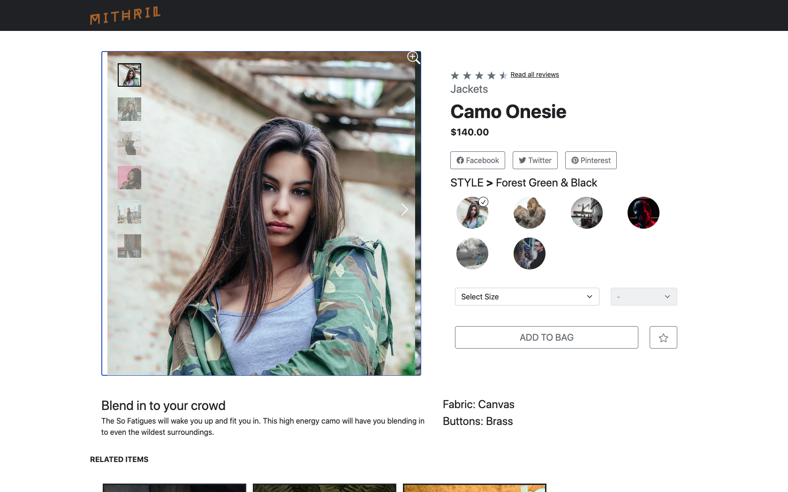
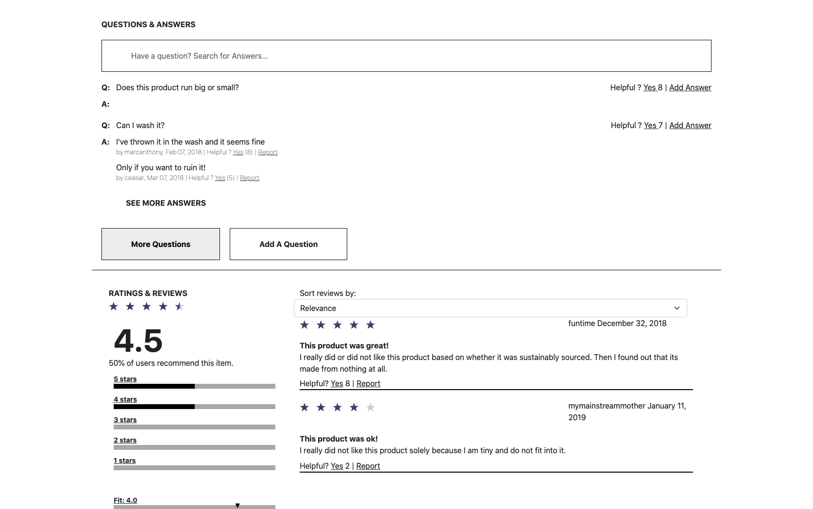
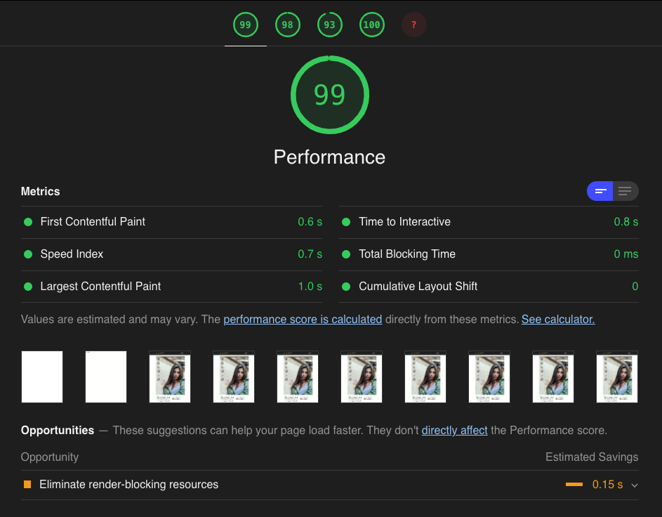

# Mithril

Mithril is a responsive single-page web application for browsing, purchasing, and providing feedback on stylish modern clothing. 

Check out the deployed app on Heroku [here](http://glacial-dawn-48786.herokuapp.com/)!

## Table of Contents

- [Description](#description)
- [Optimization](#optimization)
- [Technologies](#technologies)
- [Installation](#installation)
- [Team Members](#team-members)
- [Roadmap](#roadmap)
- [License](#license)

## Description

With this project, we sought to build from scratch a sleek, functional, e-commerce product page with all of the features expected for a top-notch user experience. This repo shows the front-end codebase, built with React and served with an Express server running on Node.js.

The back-end implements a service-oriented architecture, comprised of three independently scalable services for product information, product questions/answers, and product reviews, which are optimized for their individual use cases. Check out the products information service [here](https://github.com/daniel-he-dev/Mithril-products).


When opening the app, the user is greeted with details on the currently selected product. 
- This section allows the user to browse photos of the product in multiple styles, prices with potential discounts, available sizes and quantities, and a brief description with product features. 
- The user may add a product to the cart, navigate to the reviews section, navigate to a related item's product page, or post the item to social media.



Below, the user finds a question and answer section and a reviews section.
- The user may submit questions and answers, like or report previous questions and answers, and search for a specific question.
- An average product rating is also available, with specific ratings for different criteria. Text reviews are also available to read, sorted, or submitted through a pop-up modal.



## Optimization

Upon feature completion, the user experience was optimized to achieve stellar performance, adherence to best practices/accessibility requirements, and search-engine optimization. Performance was enhanced through various techniques to bring the Speed Index from 6.3s to 0.7s. Below are some high impact adjustments.
- Brotli Text Compression (reduced bundle size)
- Bundle minification (reduced bundle size)
- Selectively deferring script in html (pruning non-critical javascript)
- Code-splitting through React.Lazy (partitioning bundle to prioritize above-the-fold content)
- Parallelizing independent network requests (optimize network latency)



## Technologies

<table>
  <tr>
    <th>Front-End</th>
    <th>Back-End</th>
    <th>Hosting</th>
  </tr>
  <tr>
    <td>
      
    </td>
    <td>
      
    </td>
    <td>
      
    </td>
  </tr>
</table>

## Installation

After forking the repo and cloning to local machine, follow these steps to install.

1. Run `npm install` to download dependencies.
2. You will need to set up a `.env` configuration file with a private GITHUB Authentication Token in the following form in your root directory.

```js
TOKEN = YOUR_KEY_HERE;
```
### Development

- Run `npm run start` to bundle the current files and watch for changes.
- Run `npm run server` to spin up the server and watch for files changes.

### Deployment

- Run `npm build` to bundle the client code.
- Run `npm start` to start up the server.
- You may now access your app at `http://localhost:3000`.

## Team Members

- [Daniel He](https://github.com/daniel-he-dev)
- [Matthew Budiman](https://github.com/mattBman23)
- [Jason Fleming](https://github.com/jfleming9357)
- [Cayla Cardiff](https://github.com/cayla-c)

## Roadmap

- More robust test suites, including integration and E2E testing
- Standardization and minification of CSS styles
- Continuous Integration/Deployment
- Additional user features

## License

MIT License
